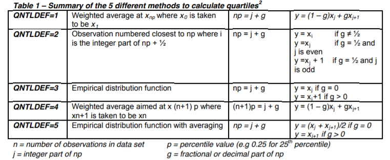

# Clinical.SAS

## Proc mixed normality
If you know the distribution from which the data is generated, then PROC GLIMMIX will suit your needs.  Unusual links (transformations) can be handled programmatically.
If you are determined to use PROC MIXED, then the key is making the RESIDUALS normal. 
Example:
proc mixed data=example2 plots=residualpanel;
class person sex;
model y = sex age1(sex) / noint s ddfm=kr
outpm=resm vciry residual;
repeated / type=cs sub=person group=sex r=1,12;
estimate 'diff in ints' sex 1 -1;
estimate 'diff in slopes' age1(sex) 1 -1;
run;

### About DDFM= option in Proc mixed

ddfm=kenwardroger or ddfm=kr denotes a denominator degree of freedom approximation method developed by Kenward-Roger.
This method provides Satterthwaite-type d.f. for unbalanced longitudinal data, or when TYPE=UN option is used.
DDFM=SATTERTH and DDFM=KR provide d.f. with decimals.

DDFM=RESIDUAL, DDFM=CONTAIN, DDFM=BW (Between-Within) are "exact methods" used in situations where the design is balanced and the variance-covariance structure is simple. 
When data are unbalanced and/or the model involves complicated covariance structures, the test statistics for fixed-effects floolow unknown distributions, the "approximate" methods such as Satterthwaite's method or Kenward-Roger's method should be used to approximate d.f. for the fixed-effects in a multilevel model.

When different d.f. methods are used, parameter estimates, standard errors, t-ratio and F-value are basically the same, but the denominator d.f. and p-values are different for fixed effects.
In general, Satterthwaite and Kenward-Roger methods, particularly the latter, are recommended by statisticians. However, both SATTERTH and KR methods are computationally intensive, particularly when the model is complex and sample size is large. In comparison, the option DDFM=BW provides very similar results to DDFM=SATTERTH and DDFM=KR with much less computation time. However, in general, DDFM=KR or DDFM=SATTERTH are perferred d.f. methods for reporting final model results.

Note: with DDFM=SATTERTHWAITE or DDFM=KENWADROGER or DDFM=KENWADROGER2, unadjusted p-values in tests are based on the degree of freedom specific to that comparison. P-avlues that are adjusted for multiplicity, however, are by default based on the denominator degrees of freedom for the Type 3 test of the fixed effect. If you specify the ADJDFE=ROW option in the LSMEANS statement, the adjusted p-values take into account the row-wise degrees of freedom.

## About CMH test output
The choice for the 3 p-values from the output:
1. General association: When the row and the column variables are both nominal (unordered). The only alternative hypothesis of interest is that there is some association between the row and column variables. Similar to Chi-square test.
2. Mean score difference: If the column variable is ordinal, assigning scores to column variable produces a mean o each row. The association between row and column variables can be expressed as a test of whether these means differ over the rows of the table, with r-1 df.
3. Linear association: When both row and column variables are ordinal. We could assign scores to both variables and compute correlation.

## Quartiles calculation in SAS
the QNTLDEF(PCTLDEF) option to set the method used by the SAS procedure to compute quartiles.
The default method used by SAS, is QNTLDEF=5.

|  |
